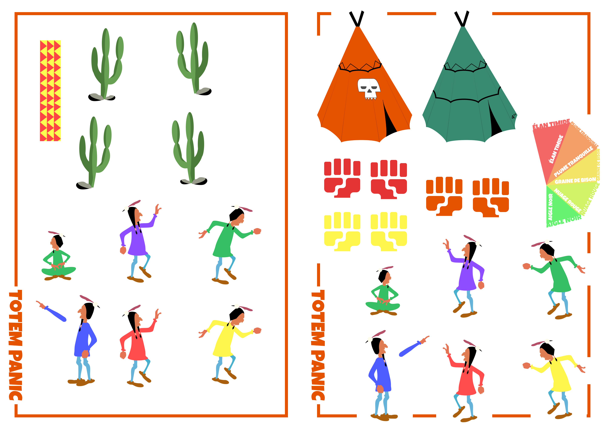
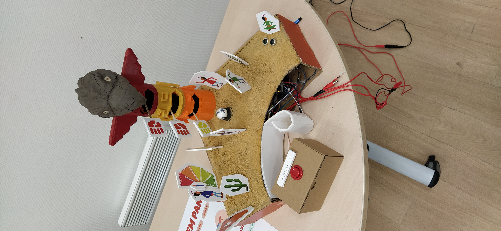
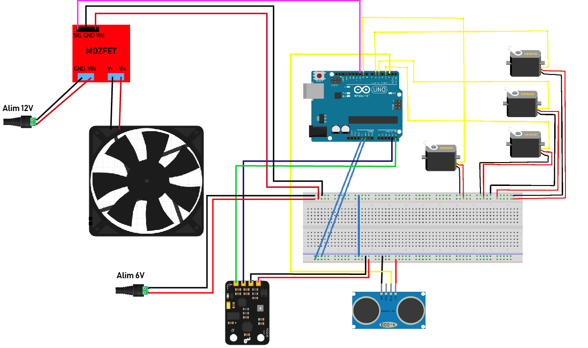

<div align="center">
<br>

<br>

<br>

<br>
</div>

----
# Introduction
Totem Panic is a game developed during an electronics class at L'École de design de Nantes Atlantique. It features a very simple but extendible gameplay, and delight try-hard lovers.
You will find below instructions to reproduce this game.

Made by [Théo Geiller](theogeiller.com) and [Raphaël Perraud](raphaelperraud.com)

<div align="center">

</div>

## History (#History)
Our concept evolved through different experiments and ideas, at the begin we want to create a game with a led band, we thought about many games like Guitar Hero, Fruit Ninja and a clicker battle Royal which is a trend on video games industry but we want to avoid led because it's to similar with a screen and we want design and conceive simple and natural interaction out of screen. We play with ventilation a lot and imagine a pong with the breath. Finally, we discovered this simply but satisfying interaction with the ventilation controlled by ultrasonic sensor. It's like the force in Star Wars or Wingardium Leviosa in Harry Potter. We go with this interaction and design a level for creating gameplay with this interaction.

## Gameplay
Natives are processing a ritual in order that their departed will be able to go to the Nirvana, but the totem gone crazy! Will you achieve to help them and stay on air until the end of the ritual?
According to the duration the player keeps the soul ball on air, and he will get a shaman rank, from "élan tranquille" to "aigle noir". 

> For now, no one went further than "plume tranquille", we still are waiting for great shamans !

The player can start a game by placing his hand upon the shaman on the right of the board game, and control the soul ball by raising or lowering his hand upon it.

## Hardware setup
This is the materiel required to build this game :
- Arduino UNO
- 1 breadboard
- DFRobot VL53L0X
- ultrasonic sensor (we use a Grove one)
- 4 angular servomotors (180° is enough)
- ventilation
- mozfet
- speaker (not implemented yet)
- 1 button
- 2 powers (6V and 12V for the ventilation)
- some pencilboard
- a box (carton is ok)
- styrofoam bullet
- some print wire
- wooden bar
  

### How to build it ?
#### Model
You need to print this 3d model with PLA 3d printer, object can be fixed to each other, you need wood or metal bar to fix the Servos in order to have the axis in front of mouths of the totem. Cables can pass through cardboard from the totem to into cardboard.

Print the 2d assets in A3 paper. Fix all these assets on cardboard or feather cardboard. And cut to detach all assets into object. You can fix quickly and easily these object on the board. For the scores board fix the arm to a Servo axis and the Native and score object to the Servo.

<div align="center">

</div>

For the sand texture you can mix flour and warm water spread this in all board surface and apply the sand. Let dry 2 hours.

<div >

</div>


For sound we have mixed a generic of a famous cartoon named Yakari, the rhythm varies from slow to fast for a better immersion in the Indian universe and in the evolutive gameplay.

@todo : schéma de la maquette

#### Connections



### Programming

#### Libraries
We used many libraries, all available from the Arduino libaries manager except one : 
 [DFRobot VL53L0X](https://github.com/DFRobot/DFRobot_VL53L0X) - you have to clone this repo into your Arduino libraries folder.
 Download others from the Arduino libraries manager :
 - Ultrasonic
 - Software Serial
 - Wire
 - Servo
 - MP3Player_KT403A (not implemented yet)

You have to include all of them in your **sketch** :
```C
#include "Ultrasonic.h" // importer la bibliothèque

#include <SoftwareSerial.h>
#include <MP3Player_KT403A.h>

#include <Servo.h>

#include "DFRobot_VL53L0X.h"
#include "Wire.h"
```

#### Variables declaration

Now we need to define many variables.
We define variables for PIN to be sure to select the same during all the program : 
```C++
#define micro 2 // ultrasonic sensor
#define airPowerPIN 11 // ventilation
#define hp 11 // speaker ( not implemented yet )
#define totem1PIN 3 // totem servomotor
#define totem2PIN 5 // totem servomotor
#define totem3PIN 6 // totem servomotor
#define indianScorePIN 9 // score servomotor
```
Some libraries need to set objects in order to use sensor, so we have to define them also :

```C++
SoftwareSerial mp3(12, 13);  // ( not implemented yet )
Ultrasonic ultrasonic(2); // "sig" pin connected to "D2" arduino pin

DFRobotVL53L0X sensor;

Servo t1 ;
Servo t2 ;
Servo t3 ;
Servo indianScore ;
```

Some others are required for our program : 
```C++
uint16_t ritualDuration = 120000 ;// 2min game 
uint32_t startGame = 0 ; // will be reset at each start
long inactive = 0 ; 
uint8_t inactiveDuration = 1000 ; // used to create a delay
boolean looseToConfirm = true ; // to confirm the loose of the player
long looseTimeToConfirm = 0 ; // to avoid issues

// uint8_t score = 0 ;
boolean isGaming = false ; // game status

// totem motors = tm
// variables used for motors, names should be quite explicit
long tm_storage = 0 ;
uint16_t rotation_timestamp = 1000 ;
long delayMotors = 0 ;
boolean rotationDelay = false ;
uint16_t tm_timestamp = 2000 ;
boolean totemRotation = true ;
uint8_t tm_angle = 50 ;

uint8_t maxUltrason = 43 ; // don't know why this value change sometimes between ~ 40 & 150, you have to check it before set up your game
```

#### Setup
In the setup, you have to declare the mode of every pin used : **INPUT** for sensors ( Ultrasonic range, DFrobot), and **OUPUT** for motors, ventilation, speaker.
The **servo** library use a particular function to link objects declared before to the pin : **attach()**.
**Wire** and the **DFRobot** need also to "wake up" by using the **begin()** function, and set the mode of data capture.

In setup we also set every servomotors to 0, to begin with all on the same side.   
```C++
void setup() {
  Serial.begin(115200); // set the Serial baud rate, you will have to set to the same value (on the bottom right of the window)
  pinMode(airPowerPIN, OUTPUT);
  pinMode(micro, INPUT);
  pinMode(hp, OUTPUT);
  pinMode(totem1PIN, OUPUT);
  pinMode(totem2PIN, OUPUT);
  pinMode(totem3PIN, OUPUT);
  pinMode(indianScorePIN, OUPUT);
  Wire.begin();
  sensor.begin(0x50);
  sensor.setMode(Continuous, High);
  sensor.start();

  t1.attach(totem1PIN);
  t2.attach(totem2PIN);
  t3.attach(totem3PIN);
  indianScore.attach(indianScorePIN);

  t1.write(0);
  t2.write(0);
  t3.write(0);
  indianScore.write(180);

  mp3.begin(115200);
  SelectPlayerDevice(0x02);       // Select SD card as the player device.
  SetVolume(0x1E);   // Set the volume, the range is 0x00 to 0x1E.
  
}
```

#### Loop
Because the loop in continuously read we can't use blocking code, so many conditions permits to check the current state.

We check first if a game is running, then if the player loses (1). If not, so the game is still running, so we have to check the position of his hand, adapt ventilation power, update score, turn motors (2). If no game is running, we have to check if a player wants to start a game (3).

##### 1. First conditions
The second condition is required to avoid some issues that can occurred when we start a game because the ball didn't have the time to raise up. We use the DFRobot which is on the top of the totem to determine if the ball is still flying, and so, if the player is still in the game or if he loses. So, we need to wait a little, in order that the ball reach the minimal height.

```C++
if ( isGaming ) {
    
    if ( (sensor.getDistance() > 299) && (millis() > startGame + 3000)) { // soul ball out : wait 3 sec after the game started to avoid wrong manipulations at the beginning
      // to avoid sensor fluctuations : be sure that ball is out by expecting 2 sec
      if (!looseToConfirm) { // set timestamp which will confirm the loose
        looseTimeToConfirm = millis() ;
        looseToConfirm = !looseToConfirm ;
      }

      if (millis() > looseTimeToConfirm + 100 ) { // is loose is recognized, so player is a looser ( bouhouhou )
        looseGame();
      }

    }
}
```

##### 2. Second conditions
If a game is running, we now check the height of the hand and check if it still on the range of the ultrasonic sensor. If not, we prevent the player by setting the ball to its minimal height. If no hand is detected during a determined duration (**inactiveDuration**), so the player loose the game.

If a hand is detected, we transfer the height to the ventilation: the **map** function convert a value which is a predetermined range in another one. Because we connect the ventilation on a PWM pin, we can use the **analogWrite()** function to set a progressive value between 110 and 255.

```C++
else { // soul ball in
      //Serial.print("ball in : ");
      //Serial.println(sensor.getDistance());

      ////////////// DISTANCE SENSOR ////////////
      int range = ultrasonic.MeasureInCentimeters();
      //Serial.print("range : ");
      //Serial.println(range);

      if ( range > 150) { // if no hand is recognized in the ultrasonic sensor, set to minimum height
        analogWrite(airPowerPIN, 110);

        Serial.println("no hand is detected. Come back quickly !");

        if ( abs(inactive - millis()) > inactiveDuration ) {
          inactive = millis() ;
          Serial.println("inactive set");
        }

        if (isTimeToAct(inactive, inactiveDuration)) { // if player became inactive, so loose game
          Serial.println("you have been inactive during too long, you lose");
          looseGame();
        }

      } else {   // normal behavior when a hand ( or object ) is in the range
        uint8_t sigma = int(map(range, 0, maxUltrason, 110, 255));
        // Serial.print("sigma : ");
        // Serial.println(sigma);
        analogWrite(airPowerPIN, sigma);
      }
```

Motors are activated periodically (**tm_timestamp** is the duration of the delay) ; so we need to check when it's possible thanks to the **isTimeToAct(storage, delay duration)** function. We talk about it later. The boolean **totemRotation** permits to choose the good rotational direction.

```C++
      if (millis() > startGame + 3000) {
        if ( isTimeToAct(tm_storage, tm_timestamp) ) {
          
          if (!rotationDelay){ // set base timestamp to create delay between motors
            delayMotors = millis();
            rotationDelay = !rotationDelay ;   
          }
          
          if (totemRotation) {
            moveTotemMotors_left();
          } else {
            moveTotemMotors_right();
          }
        }
      }
```

##### 3. Starting game condition
If no game is running, we are always checking if a hand appears on the range of the ultrasonic sensor, to start a new game. We constrain the range between 2 and 20 in order to avoid wrong movements that can activate a game.

#### External functions

##### Win & Loose
They are almost the same, because we need in both case to reset many variables, and we wait for the player remove his hand to let a new game start (otherwise, a new game restart immediately after a defeat). But their is a main difference: one is dedicated for the winner, the Great Black Hawk, the Native's Messie. The other one is hillbillies, loosers; we can't put the two in the same bag!

##### isTimeToAct()
Return true if the delay is passed. It permits to creates a non-blocking delay.

##### moveTotemotors()
The **isTimeToAct()** function permits to activate motor one after the other, by passing different timestamp in arguments. Because we use angular servomotors, the value **written** correspond to an angle, not to a speed, so we don't care if some blocs of code are read many times: so when the third motor is activated, the condition for the previous are also true, but it doesn't affect anything.
We reset variables in this last condition.

```C++
  if (isTimeToAct(delayMotors, 0)) {
    t1.write(tm_angle);
    Serial.println("totem 1 motor moved to left");
  }

  if (isTimeToAct(delayMotors, 1000) ) {
    t2.write(tm_angle);
    Serial.println("totem 2 motor moved to left");
  }

  if (isTimeToAct(delayMotors, 2000)) {
    t3.write(tm_angle);
    Serial.println("totem 3 motor moved to left");
    
    totemRotation = !totemRotation ;
    rotationDelay = !rotationDelay ;
    tm_storage = millis();
  }
```

### Conclusion
You will see three arduino sketches in this repo, the main one is **totem_panic**. In this one, you will also find a indianmusic.ino and a notes.h, which was old files to create digibit music, but we changed it to implement a mp3 reader from a SD card. This is not completely implemented yet, so it's commented for now.
We wish to add it soon.

### Copyright and further use
---
This game is completely open source so feel free to use it, reproduce it or modify it as you want. A credit to the original project is not mandatory but would be highly appreciated, so feel free to talk with us about ideas of improvement or modifications.

For further informations, please contact us :
[r.perraud@lecolededesign.com](r.perraud@lecolededesign.com)
[t.geiller@lecolededesign.com](t.geiller@lecolededesign.com)

[history back](#History)

<iframe src="https://player.vimeo.com/video/391677442" width="640" height="360" frameborder="0" allow="autoplay; fullscreen" allowfullscreen></iframe>
<p><a href="https://vimeo.com/391677442">JoiML - Interface concept for lazy Blade Runners</a> from <a href="https://vimeo.com/r4ph3rd">r4ph3rd</a> on <a href="https://vimeo.com">Vimeo</a>.</p>
